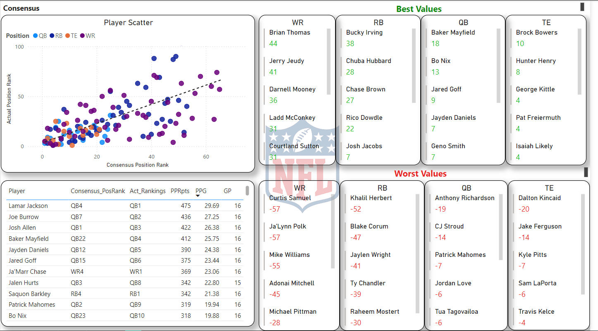

# 2024FFAnalysis
This is an analysis of the 2024 Fantasy Football season using SQL and visualized with PowerBi.

Fantasy Football 2024: ADP vs. Actual Performance Analysis

This project involved analyzing 2024 fantasy football player performance compared to their Average Draft Position (ADP) projections.

## Data Flow

### Data Collection:

Scraped ADP data from NFL.com, ESPNFantasy.com, and Rotowire.com.
Collected actual performance data from footballdb.com.
Exported all datasets into CSV files.

### Data Preparation:

Imported CSV files into a SQL database using SQLite DB Browser.
Created SQL queries to generate data views for analysis.

### Data Visualization:

Loaded SQL query outputs into Power BI.
Enhanced the data using Power Query Editor for better visualization and analysis.
Created a 4-page Power BI report with key insights, including:
  Scatter plot with trendlines: Showcasing how closely players performed to their projected ADP.
  Player performance table: Highlighting pre- and post-season rankings, total points, and points per game (PPG), with a        focus on the impact of missed games.
  Top/Bottom 5 cards: Identifying players who significantly over- or underperformed their ADP by fantasy football site.
#### Page Preview

  
## Key Insights

### Site-Specific Observations:
NFL.com:

Had the most significant projection misses, both in underestimating and overestimating player performances.
Likely the least reliable source for pre-season projections.

Rotowire:

Closest to consensus projections and highlighted several valuable players in early rounds.
Best source for pre-draft information, albeit with a subscription fee.

ESPN:

Neither remarkably strong nor weak in projections but stands out for its accessibility due to free content.

### Best and Worst Player Values:

Top 3 Values:

  Brock Bowers
  Brian Thomas
  Baker Mayfield
  (Factors: Positional value, season-long consistency, and projected ADP vs. actual results)
  Honorable Mentions: Bucky Irving and Chuba Hubbard for consistent contributions.

Bottom 3 Values:

  Anthony Richardson
  C.J. Stroud
  Marvin Harrison
  (Factors: Positional value, inconsistency, and ADP vs. actual results)
  Honorable Mentions: Dalton Kincaid and Patrick Mahomes for underperforming at critical positions.

## Conclusion

This project was a hands-on opportunity to deepen my expertise with SQL and Power BI while answering important questions about 2024 fantasy football performance trends. While the analysis addressed my initial objectives, it also raised additional questions worth exploring in future iterations.

### Future Directions:

Dive deeper into individual fantasy point scoring patterns.
Expand the scope to include more granular data and historical trends.
Explore player-specific scenarios, such as injuries or role changes.

## Data Caveats

To maintain focus, some data was excluded from the analysis:

Players who played fewer than 8 games (e.g., Christian McCaffrey, Rashee Rice) to avoid skewing insights.
Exceptional cases, such as Kareem Hunt, whose unexpected production resulted from unique circumstances.
This project reflects my passion for data analytics and sports, showcasing the potential of leveraging SQL and Power BI for actionable insights.

### Project Files
- [PowerBi Report for FF2024 (PowerPoint)](./FF2024Analysis.pptx)
